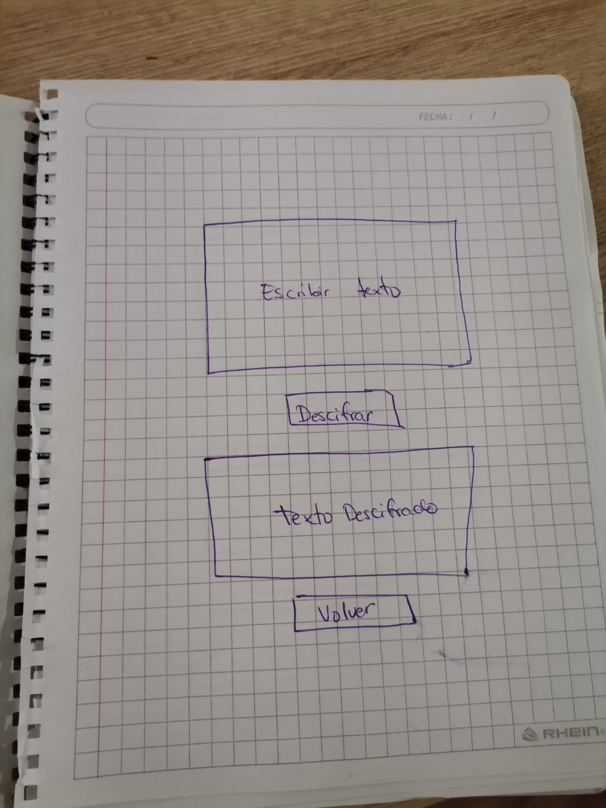
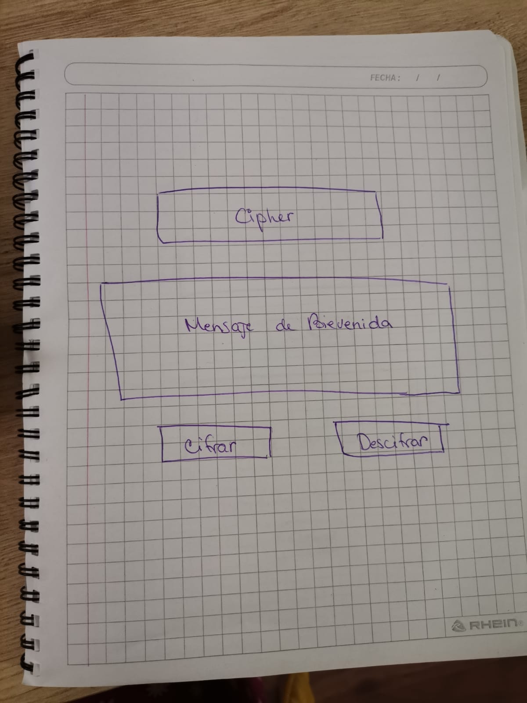
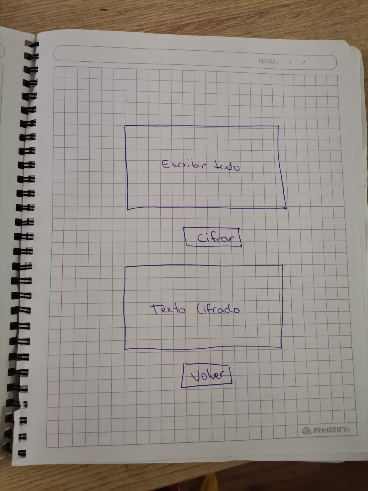
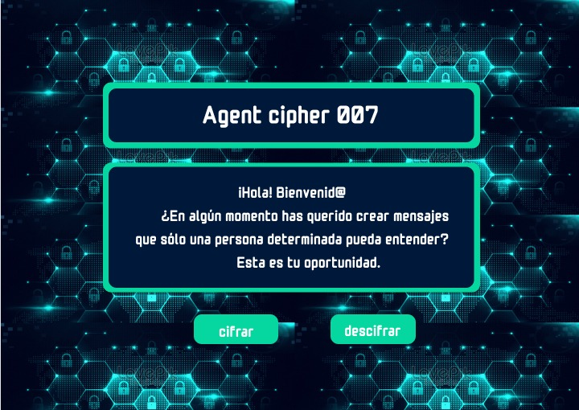
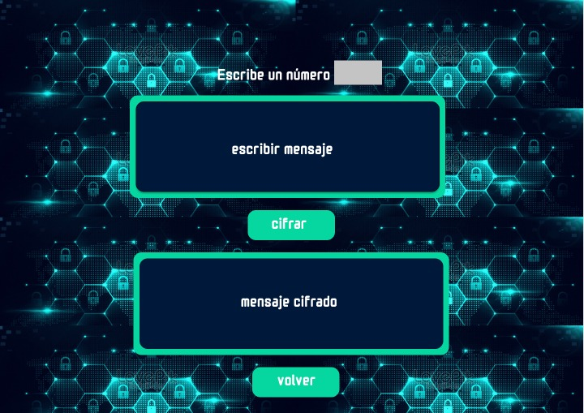
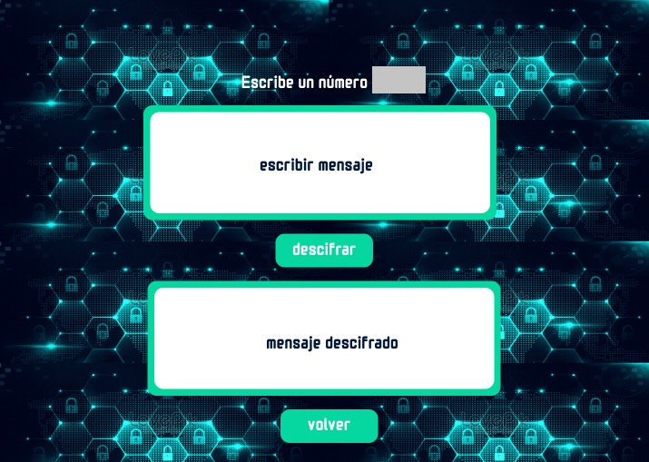

READ ME

Este producto fue pensado y diseñado para un  publico joven de entre 18 y 30 años de edad, que quiera jugar
a ser espia y quiera utilizar esta herramienta de cipher para enviar mensajes codificados y tambien decodificar mensajes recibidos previamente. 

Al inicio del proyecto, hice un  diseño en papel que me sirvió para tener una idea general de la vista de la interfaz de la página.

Luego, basándome en el diseño realizado a mano alzada hice el diseño en figma, lo que me ayudo a elegir 
la paleta de colores y hacer un diseño de mejor calidad, ya pudiendo ver de manera más tangible lo que queria obtener en el resultado final.

Una vez terminado los prototipos de baja y alta, inicié el codico y lo primero que hice fue los html y darles estilo con css, luego, me enfoque en la funcion de la pagina. para lo cual, utilice index.js para dar la funcion de cambio a mayusculas del texto que se recibe en la pagina cifrar
y luego dar funcion al boton cifrar, index2.js para dar funcion al boton descifrar y cipher.js para colocar las funciones codificar y decodificar. 
